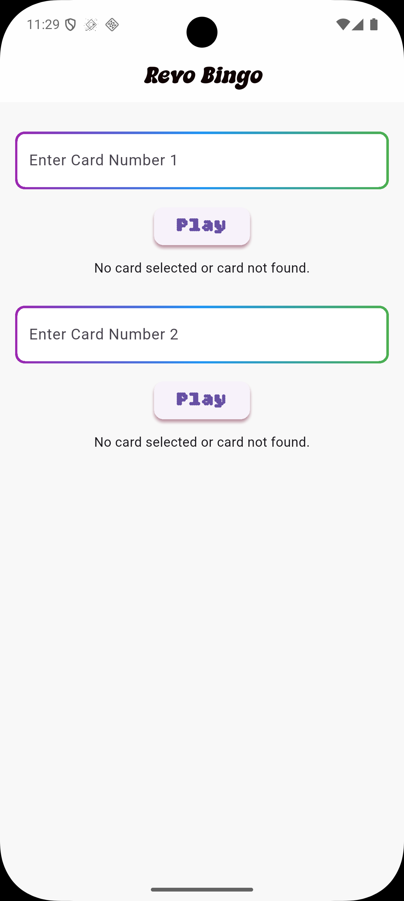

# Bingo

A cross-platform Bingo game built with Flutter. **Note: This app currently supports only Android.**

This project demonstrates a modern, responsive UI and interactive gameplay for Bingo enthusiasts.

## Description

Bingo is a simple, fun, and fully customizable Bingo app. You can generate Bingo cards, mark numbers, and play with friends. The app supports Android devices and is easy to extend or modify.

## Tools Used

- Flutter
- Dart
- Font Awesome Flutter
- Custom fonts and assets

## How to Use / Fork

1. **Clone the repository:**
   ```
   git clone https://github.com/NahumDm/bingo.git
   ```
2. **Install dependencies:**
   ```
   flutter pub get
   ```
3. **Run the app:**
   ```
   flutter run
   ```
4. **Fork:**
   Click the "Fork" button on GitHub to create your own copy and start contributing!

## Screenshots





## How to Download from Release

- Go to the [Releases](https://github.com/NahumDm/bingo.git/releases) page.
- Download the latest APK for Android.

## License

This project is free to use and modify. All assets and code are provided under the MIT License unless otherwise specified.

## Collaboration & Stars

- Contributions, issues, and feature requests are welcome!
- Feel free to open a pull request or start a discussion.
- If you like this project, please star it on GitHub and share with others!
